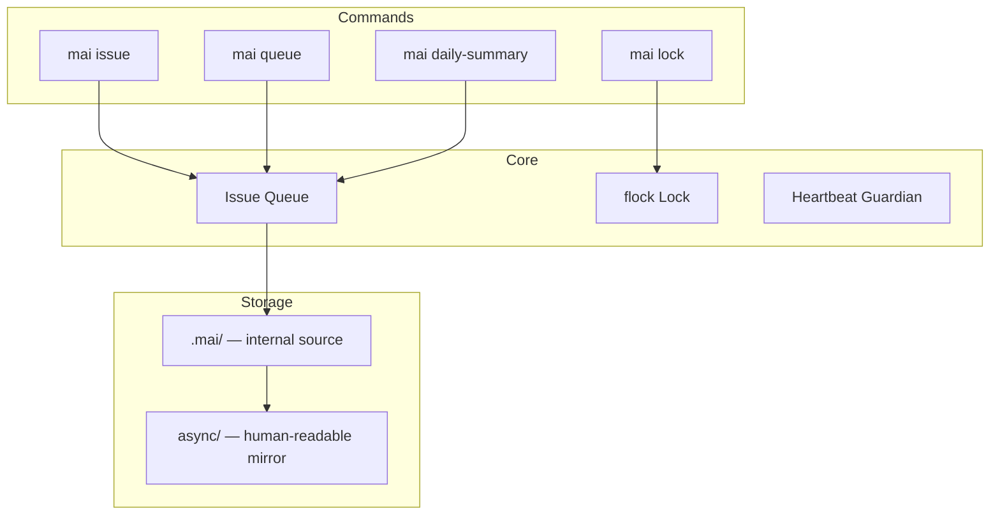

# Mai CLI

**English** | [简体中文](./README_zh.md)

[](https://pypi.org/project/mai-cli/)
[](LICENSE)
[](https://pypi.org/project/mai-cli/)

> Multi-Agent Coordination CLI — enables multiple AI agents to collaborate autonomously via a standardized command interface, backed by flock-based atomic locking.

---

## ✨ Features

- 🔒 **Atomic flock locks** — race-condition-free claim/complete via POSIX `fcntl.flock()`
- 📋 **Standardized commands** — full Issue lifecycle, queue scanning, lock management, audit logs, daily summaries
- 📁 **Dual-layer storage** — `.mai/` as internal source, `async/` as human-readable mirror
- ⚙️ **JSON configuration** — queue SLA, agent heartbeat, issue ID prefix all in `config.json`
- 🔄 **Concurrent-safe daily summaries** — multiple agents write simultaneously with flock protection
- 🌍 **Global Infrastructure** — centralized management of global config and project registry in `~/.mai-cli/` (v1.10.0+)
- ✅ **Idempotent writes** — repeating any operation preserves state
- 📦 **Zero dependencies** — Python 3 stdlib only

---

## 🏗️ Architecture



---

## 🚀 Quick Start

### Requirements

- Python 3.8+ (stdlib only, no external dependencies)
- Linux / macOS / WSL (POSIX environment)

### Install

```bash
pip install mai-cli
```

### Minimal Example

```bash
# 1. Initialize project
mai init

# 2. Register an agent
mai agent add alice --heartbeat-minutes 30

# 3. Create an issue
mai issue new questions "Technical review" -o alice

# 4. Claim issue (auto-locks)
mai issue claim REQ-001 -o alice

# 5. Complete issue
mai issue complete REQ-001 "Approved for implementation" -o alice

# 6. Check queue
mai queue check --overdue
```

---

## 📖 Documentation

| Document | Description |
|:---|:---|
| [Deployment](./docs/DEPLOYMENT.md) | Deployment guide |
| [Command Reference](./docs/references/commands.md) | Full command reference |

---

## 🤝 Contributing

PRs and Issues are welcome!

1. Fork this project
2. Create a feature branch `git checkout -b feature/AmazingFeature`
3. Commit your changes `git commit -m 'feat: Add some AmazingFeature'`
4. Push to the branch `git push origin feature/AmazingFeature`
5. Open a Pull Request

---

## 📄 License

MIT License — see [LICENSE](LICENSE).

---

*Mai CLI v1.9.2*