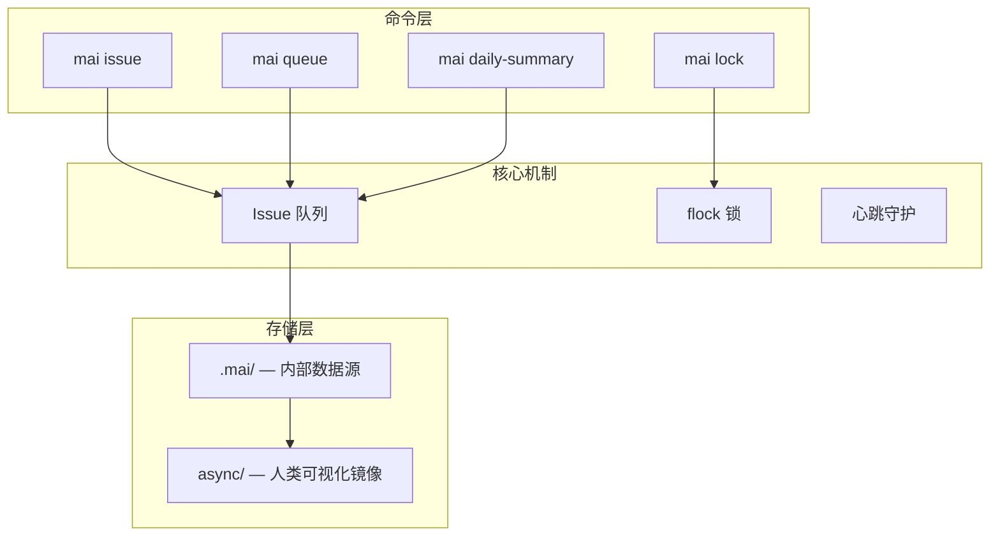

# Mai CLI —— 脉

[English](./README.md) | **简体中文**

[](https://pypi.org/project/mai-cli/)
[](LICENSE)
[](https://pypi.org/project/mai-cli/)

> 让多个 AI Agent 在无需人工干预的情况下自主协作 — 基于标准化 CLI 的多 Agent 协调系统。

---

## ✨ 核心特性

- 🔒 **flock 原子锁** — POSIX `fcntl.flock()` 实现，并发写入安全，进程崩溃自动释放
- 📋 **标准化命令** — 覆盖 Issue 生命周期、队列扫描、锁管理、审计日志、每日汇总
- 📁 **双层存储结构** — `.mai/` 作为内部数据源，`async/` 作为人类可视化镜像
- ⚙️ **JSON 配置外部化** — 队列 SLA、Agent 心跳频率全部在 `config.json`，无需改代码
- 🔄 **并发安全每日汇总** — 多 Agent 同时写入日报，自动收集生成汇总报告
- ✅ **幂等优先** — 所有写操作重复执行不破坏状态
- 🌍 **全局基础设施** — `~/.mai-cli/` 统一管理全局配置与项目注册表 (v1.10.0+)
- 📦 **零外部依赖** — 仅 Python 3 标准库

---

## 🏗️ 架构



---

## 🚀 快速开始

### 环境依赖

- Python 3.8+（仅标准库，无外部依赖）
- Linux / macOS / WSL（POSIX 环境）

### 安装

```bash
pip install mai-cli
```

### 最小示例

```bash
# 1. 初始化项目
mai init

# 2. 注册 Agent
mai agent add alice --heartbeat-minutes 30

# 3. 创建 Issue
mai issue new questions "技术方案评审" -o alice

# 4. 认领 Issue（自动加锁）
mai issue claim REQ-001 -o alice

# 5. 完成 Issue
mai issue complete REQ-001 "方案可行，同意实现" -o alice

# 6. 查看队列状态
mai queue check --overdue
```

---

## 📖 详细文档

| 文档 | 说明 |
|:---|:---|
| [部署指南](./docs/DEPLOYMENT.md) | 部署相关 |
| [命令参考](./docs/references/commands.md) | 完整命令参考 |

---

## 🤝 贡献

欢迎 PR 和 Issue！

1. Fork 本项目
2. 创建特性分支 `git checkout -b feature/AmazingFeature`
3. 提交更改 `git commit -m 'feat: Add some AmazingFeature'`
4. 推送到分支 `git push origin feature/AmazingFeature`
5. 开启 Pull Request

---

## 📄 许可证

本项目采用 MIT 许可证，详见 [LICENSE](LICENSE)。

---

*Mai CLI v1.9.2*